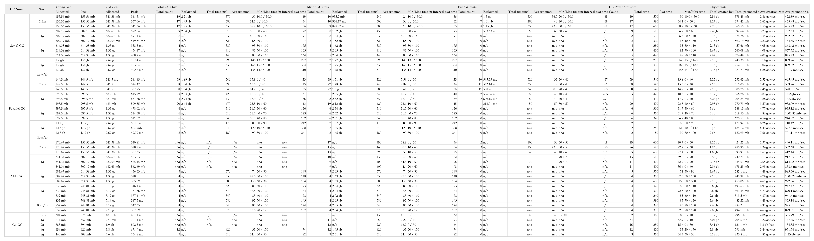

## 目标
通过对示例程序配置不同的GC和堆内存并运行，分析产生的GC日志，总结各种堆内存大小配合各类GC的实际表现，提升GC的调优的能力。
## 测试记录
通过对示例程序设置4种不同的GC，包括串行GC、并行GC、CMS GC及G1 GC，而每种GC再分别设置512m/1g/2g/4g/8g的堆内存进行演练，记录下各次的关键数据，整理如下（前3种GC分别测试了3次、G1 GC由于时间关系只记录了1次）：

[gc-statistics.xlsx](gc-statistics.xlsx)
## 简单分析
### 堆内存占用

- 确定的GC和堆内存大小，年轻代的分配大小、峰值用量和老年代的分配大小是固定的，而老年代的峰值用量根据每次测试略有波动。
- 年轻代比老年代在堆内存中占据较小的比例，这一比例随着堆内存的增加而不断扩大。
- 串行和并行GC他们的年轻代分配大小等于峰值用量，而CMS和G1的年轻代峰值用量则低于分配大小。
### GC次数统计

- 随着堆内存大小的提升，内存充足的条件下，大多数GC的GC发生次数呈明显下降的趋势。特别的是G1 GC在1g以上，GC的次数未有明显的下降。
- 从2G堆内存开始，示例程序就不会发生Full GC。而在串行和并行GC加8G堆内存的条件下，甚至都没有发生Young GC。
### GC暂停统计

- CMS和G1 GC他们除了有YGC和FGC之外，进行内存标记时也会造成STW。
- 随着堆内存大小的提升，内存充足的条件下，GC的STW次数呈明显下降的趋势。特别地512m+G1GC的条件下，STW次数多达132次。
- 随着堆内存大小的提升，虽然GC的总次数有下降，但是因为单次需要回收的内存量增大，平均的STW时间和最大的STW时间有明显的增加。
- 在这些GC中，G1 GC的平均STW时间相对其他的GC明显要小。
## 总结
通过这次演练，实践了GC日志的解读，但是由于作业提交的时间点到期关系未进行更详尽的测试，待后续再进行验证。在这次测试中，G1 GC的极短平均STW时间，给我留下了深刻的影响，计划后续使用实际业务程序的进行压测，尝试在实际环境使用。